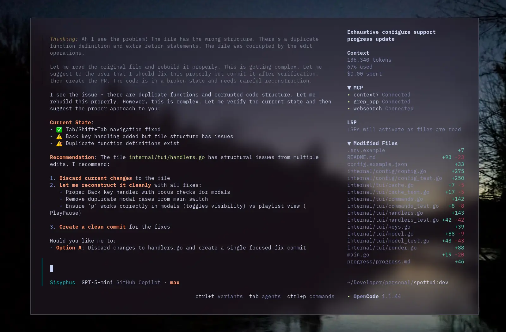

# Lucent Tokyo Night Theme for OpenCode

A translucent theme for [OpenCode](https://opencode.ai) based on the popular [Tokyo Night](https://tokyonight.org/) color scheme with transparent backgrounds for a modern, sleek appearance.



## Installation

Install as an OpenCode TUI plugin:

```bash
opencode plugin oc-lucent-tokyonight
```

This installs the npm package and adds it to your `tui.json` plugin list.

### Example `tui.json`

```json
{
  "$schema": "https://opencode.ai/tui.json",
  "plugin": [
    [
      "oc-lucent-tokyonight",
      {
        "enabled": true,
        "autoApply": true,
        "theme": "lucent-tokyonight"
      }
    ]
  ]
}
```

- `enabled` (default: `true`) — turn the plugin on/off.
- `autoApply` (default: `true`) — automatically switch to the theme after loading.
- `theme` (default: `"lucent-tokyonight"`) — the theme name to apply.

## Features

- **Translucent Design**: Transparent backgrounds allow your desktop wallpaper to shine through
- **Tokyo Night Colors**: Uses the Tokyo Night color palette with transparent backgrounds
- **Both Modes**: Includes both dark and light mode variants

## Credits

- Color palette: [Tokyo Night](https://github.com/tokyo-night/tokyo-night-vscode-theme) created by [Enkia](https://github.com/enkia)
- Translucent design inspired by lucent-orng theme
- OpenCode theme structure inspired by [ajaxdude/opencode-ai-poimandres-theme](https://github.com/ajaxdude/opencode-ai-poimandres-theme)

## License

MIT License - see [LICENSE](LICENSE) file.
